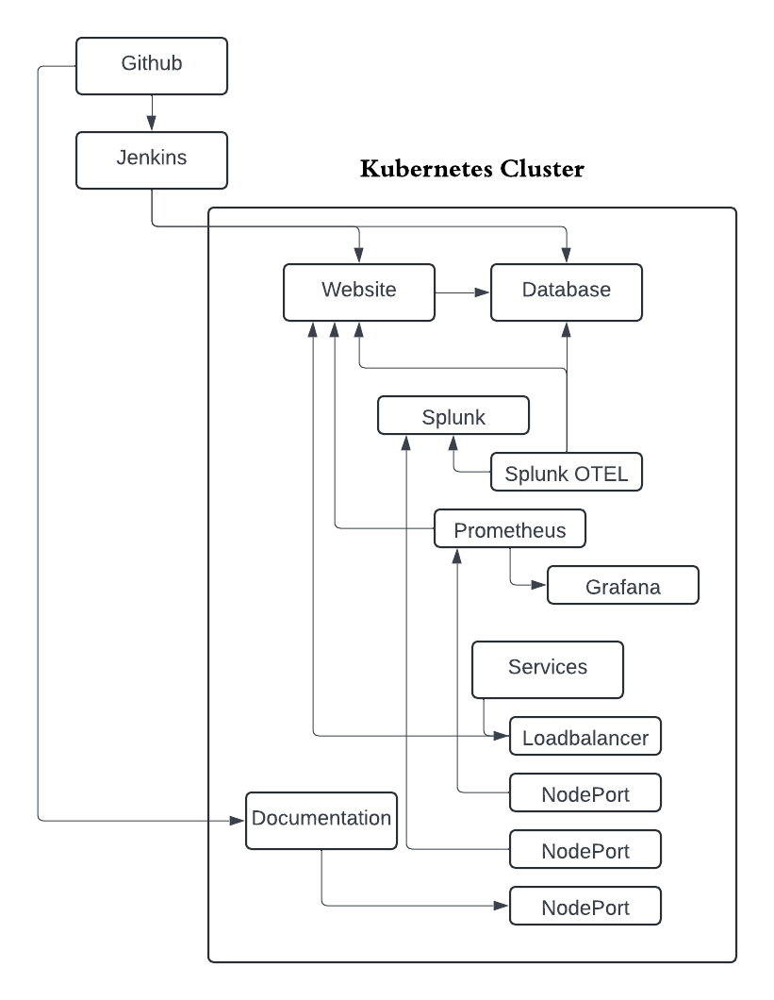

# Architecture Diagram

Below is the architecture diagram illustrating the integration of the OpsWerks Hub with Cassandra.

- **Website**: the website was build with ReactJS.
- **Database**: the database is a CassandraDB NoSQL.
- **Kubernetes**: Orchestrates the deployment and management.
- **Logging and Monitoring**: Splunk, Prometheus and Grafana was used to monitor, log and visualize data from the Website and the Database
- **Version Control**: the version control tool chosen was used is git
