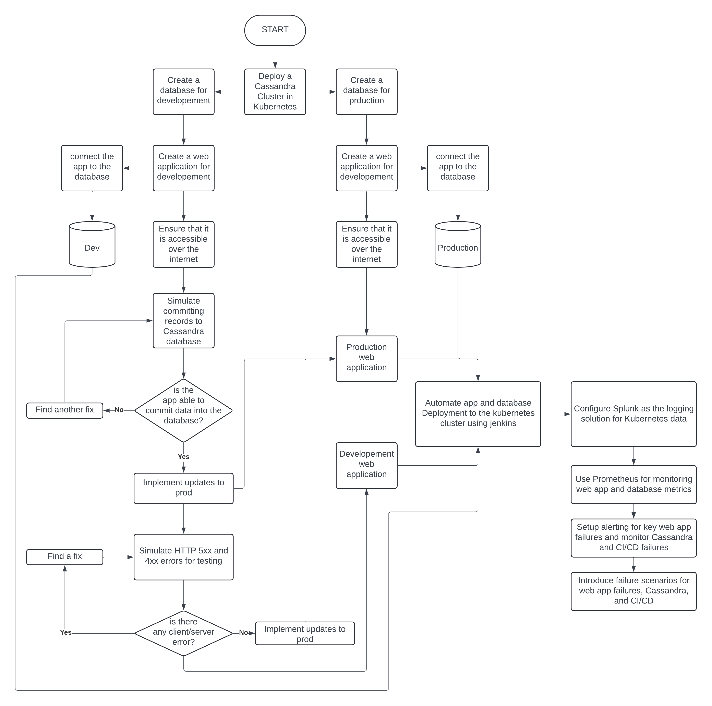

# Workflow Visualization

The solution follows a microservices-based architecture, with separate workflows for the front-end and back-end components. Below is a flowchart visualizing the process:

- The front-end communicates with the API layer, which handles interactions with Cassandra.
- Kubernetes manages multiple environments for development, testing, and production.

